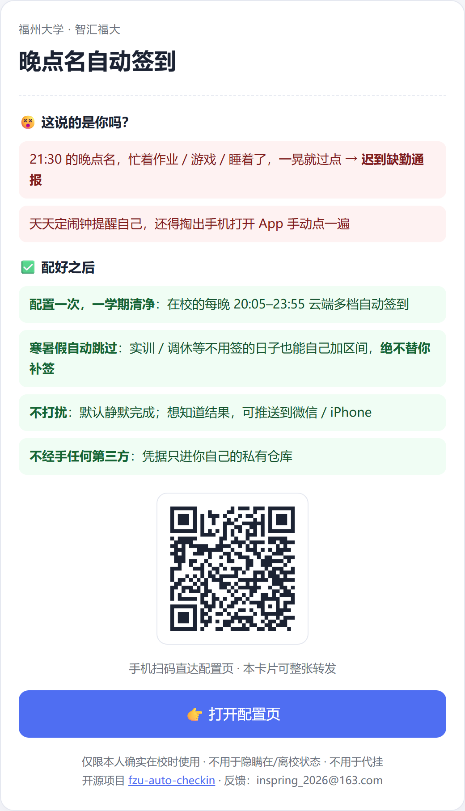

# fzu-auto-checkin · 福州大学晚点名自动签到

  

<div align="center"></div>

福州大学「智汇福大」晚点名（21:30–23:59）的自动签到工具：**每晚定时自动打卡，结果可推送到微信 / iPhone**。手机零安装，iOS / 安卓都能用。

> ⚠️ **使用须知**
>
> 晚点名是学校的安全确认制度。本项目仅用于**本人确实在校时防止漏签**，禁止用于向学校隐瞒真实在/离校状态，禁止付费代挂。违规后果由使用者自行承担。

> 🔧 **测试阶段提示**
>
> 项目仍在测试迭代中，已知限制：
> - **GitHub 定时任务可能延迟**（官方高峰期现象），已用十档时间兜底对冲，但签到可能比预期晚——以推送到的实际结果为准
> - **Token 粘贴有误**：请用[网页版配置生成器](https://cccccheyu.github.io/fzu-auto-checkin/)，Token 创建链接已勾选 `repo + workflow` 双权限，整段粘贴即可
> - **部署卡在「GitHub 网络问题」**：**强烈建议用电脑打开配置页，并挂上代理/梯子再操作**——手机网络直连 GitHub 极易超时，是部署失败的最常见原因。配置器本身已内置自动重试 + 断点续传，挂好代理后点重试即可
>
> 遇到问题欢迎[提 issue](https://github.com/cccccheyu/fzu-auto-checkin/issues)，附上报错截图更好。

## 功能

- ⏰ 定时自动签到（每晚 21:35–23:55 七个主档层层兜底，另设 20:05 / 20:35 / 21:05 提前档对冲 GitHub 定时延迟）
- 📲 签到结果推送（Server酱 / Bark / 企业微信，填一种即可）
- 🔑 支持学号密码全自动登录，token 过期自动换新，无需手工维护
- 📍 定位校验预检：坐标不在校区内会明确报错，不会乱点

## 快速开始（3 步）

### 第 1 步 · 拿到代码

```bash
git clone https://github.com/cccccheyu/fzu-auto-checkin.git
cd fzu-auto-checkin
pip install -r requirements.txt
```

### 第 2 步 · 填配置

> 🖱️ **不想手填配置？用[网页版配置生成器](https://cccccheyu.github.io/fzu-auto-checkin/)**：填完账号 / 位置 / 推送三步后，按「有没有 GitHub 账号」二选一 —— **有账号就贴个 Token 一键部署**（自动替你建私有仓库、写入代码和你的配置），没账号跟着分步引导走。另有**补假期工具**（只选起止日期即可，还能一键写回你的仓库）和**本机记忆**（填过的内容下次打开自动带出）。纯前端页面，不收集任何数据，也不记密码 / token。也可以把仓库里的 `web/configurator.html` 下载后双击离线使用。下面的手动流程照旧可用。
>
> 📣 **想拉同学一起用？发[宣传卡](https://cccccheyu.github.io/fzu-auto-checkin/promo.html)**：一页讲清痛点 + 卖点 + 二维码，扫码直达配置页，也可以直接转发链接。仓库里的 `web/promo.html` 就是同一张卡，可离线打开。

复制模板为 `config.yaml`（此文件已被 .gitignore 忽略，不会被提交）：

```bash
cp config.example.yaml config.yaml
```

逐项填写（每项怎么填都写在模板注释里）：

| 配置项 | 填什么 | 怎么获取 |
|--------|--------|----------|
| `user.username` / `user.password` | **登录智汇福大 App 的学号和密码**（推荐，全自动免维护） | 你平时登 App 用的那套 |
| `user.token` | 免登 token（可选项，与账密二选一即可） | 见 [docs/protocol.md](docs/protocol.md) §4 |
| `checkin.longitude` / `latitude` | 你在校区内宿舍楼的坐标 | 打开[高德坐标拾取器](https://lbs.amap.com/tools/picker) → 搜索你的宿舍楼 → 复制"经度,纬度" |
| `checkin.actual_location` | 打卡上报的地址文案 | 如「福州大学旗山校区生活区X号楼」 |
| `notify.*` | 推送渠道（填一种即可） | [Server酱](https://sct.ftqq.com)：微信扫码登录 → 首页复制 SendKey（SCP 开头）→ 微信里需关注「方糖」服务号才能收到；iPhone 推荐 [Bark](https://apps.apple.com/app/bark-customed-notifications/id1403753865)（**收不到 / 深夜才收到**：见下方常见问题「iPhone 收不到推送」） |

### 第 3 步 · 跑起来

**先本地试一次**（确认配置没问题）：

```bash
python main.py
```

输出「已签到 / 无需操作」或「签到成功」即为配置正确。白天试跑会显示「不在晚点名窗口，静默跳过」，属正常；只想验证配置/登录/连通可以用 `FZU_CHECKIN_FORCE=1 python main.py`（只检查，不真签、不推送）。

**然后挂到 GitHub Actions 云端自动跑**（推荐）：

1. 在 GitHub 上 Fork 本仓库，或新建一个 **私有仓库** 推送这份代码
2. 仓库 `Settings → Secrets and variables → Actions → New repository secret`，名称填 `CONFIG_YAML`，值 = 你本地的 `config.yaml` 全文
3. 完成。每天北京时间 21:35–23:55 多档自动执行（含对冲延迟的提前档），结果推送到微信

> 💡 为什么推荐私有仓库：你的凭据只通过 Secret 注入，不进代码库；Actions 免费额度对私有库也够用（每天跑一次绰绰有余）。

**备选：装在自己电脑上跑（不用 GitHub，Windows）**

在意准点、或者完全不想碰 GitHub：用**电脑浏览器**打开[配置页](https://cccccheyu.github.io/fzu-auto-checkin/)填完 1~3 步（手机上生成的话要把 bat 传回电脑再双击），在「方式 B」里下载 `setup.bat`，**双击一次全装好**——脚本会自动检查 Python（没装会给出国内镜像地址）、下载项目代码、写入配置、装依赖、创建每天 21:35 / 21:50 / 22:05 / 23:40 的计划任务，最后试运行一次（只验证，不真签）。
> 电脑要开到几点：**当晚 21:30–22:10 保持开机或睡眠即可**——21:35 首档签上后随时可关机（签没签上会推送到手机）；想绝对保险就开到 23:45（23:40 是最后一档兜底，错过也还有云端方案兜底）。

想手动部署也可以，完成上面第 1、2 步后：

1. 本地 `python main.py` 先试跑一次确认没问题（白天静默跳过属正常，验证连通见上）
2. 目录下建一个 `run.bat`（两行）：`cd /d 你的目录` 和 `python main.py >> run.log 2>&1`
3. Windows「任务计划程序」→ 创建基本任务 → 每天 21:35，操作指向 `run.bat`，属性里勾选「错过计划开始后尽快启动」
4. 也可以云端 + 本地双保险：两边逻辑幂等，先到的签掉，后到的识别「已签到」自动静默跳过


## 常见问题

<details>
<summary><b>部署卡在「GitHub 网络问题 / 超时」，或者 Token 校验失败？</b></summary>

**网络超时**：GitHub 国内直连时好时坏，手机网络尤其容易失败。

- **用电脑浏览器**打开配置页操作（手机直连 GitHub 超时的概率高得多）
- 高峰期连不上就换个时间，或者挂上代理/梯子——**只有注册和配置那几分钟需要网络好**，配好之后签到跑在 GitHub 服务器上，日常零操作、零网络要求
- 配置器内置了自动重试 + 断点续传：断了重新点「重试 / 继续部署」，已传好的文件会自动跳过，不用从头再来

**Token 粘贴有误 / 报 404**：推荐用[网页版配置生成器](https://cccccheyu.github.io/fzu-auto-checkin/)部署，第 5 步「点这里创建」会直达 token 创建页并自动勾好 `repo + workflow` 两个权限。**缺 workflow 是最常见的翻车点**——缺它会在写入工作流文件那步报 404。另外两个细节：

- `Expiration` 选 **No expiration**（默认 30 天就过期，到期会静默失效）
- 部署完成后 token 就可以删掉
</details>

<details>
<summary><b>为什么签到比预想的晚？会漏签吗？</b></summary>

**GitHub Actions 的定时任务本身会延迟**，这是官方平台现象，高峰期整批延迟 1~4 小时都出现过，跟你的代码和配置无关。

本项目用**十个时间档**层层对冲：

| 档位类型 | 时间（北京时间） | 作用 |
|---|---|---|
| 提前档 | 20:05 / 20:35 / 21:05 | 主档被整批拖走时，提前档仍在红线前跑完 |
| 主档 | 21:35 / 21:50 / 22:05 | 正常时段打卡（不迟到） |
| 保底档 | 23:00 / 23:05 / 23:30 / 23:55 | 宁迟不缺，迟到但不算缺勤 |

要真正漏签，得十个档**同时**延迟越过午夜——概率极低。另外窗口护栏（21:30–23:59 之外一律静默跳过）保证延迟补跑**不会在凌晨打扰你**，签到结果以推送到手机的实际内容为准。

想更准点：用配置页的「方式 B」装到本机（`setup.bat` 一键装，电脑当晚 21:30–22:10 开机或睡眠即可），本地任务基本准时，和云端互不冲突（幂等，先到的签掉）。
</details>

<details>
<summary><b>推送一直没收到 / 推送延迟很久？</b></summary>

按渠道分：

- **Bark（iPhone）**：见下方「iPhone 收不到推送」那条。
- **Server酱（微信）**：**必须先关注「方糖」服务号**，推送是从它发出来的，不关注收不到。SendKey 获取：`sct.ftqq.com` → 微信扫码登录 → 首页复制 `SCP` 开头的 key。
- **企业微信**：确认机器人 webhook 还在群里，且没被移出。

另外两件事值得知道：

- 脚本**签到成功后也会推一条**（「✅ 今日已签到」），所以每人每晚正常就该收到一条——收不到说明链路有问题，**收得到才说明工具真的在干活**。
- 「后续档发现已签到」是**静默跳过**的，不会再推第二条，所以一晚最多一两条，不会刷屏。
</details>

<details>
<summary><b>token 是什么？会过期吗？</b></summary>

登录态凭证。**推荐直接填学号密码**：脚本会自动登录换 token 并回写配置，全程无感。只有不想存密码的人才需要手动获取 token（过期后重新取一次即可）。
</details>

<details>
<summary><b>迟到线是几点？</b></summary>

**22:30**。21:30–22:30 打卡为正常，22:30–23:59 打卡记迟到。定时主档设在 21:35/21:50/22:05/23:00/23:05/23:30/23:55，前三档正常不迟到，后四档保底宁迟不缺；另有 20:05/20:35/21:05 提前档对冲 GitHub 定时延迟（准点到达窗口外会被静默跳过）。
</details>

<details>
<summary><b>运行报「服务器暂未返回今日计划」？</b></summary>

跨午夜时段（约 0:00–1:00）服务器尚未发布当日计划，会返回 500，属正常现象，稍后再试即可。延迟补跑一律落在签到窗口（21:30–23:59）外，会被静默跳过。
</details>

<details>
<summary><b>想装在自己电脑上跑（不用 GitHub），电脑要开到几点？</b></summary>

用**电脑浏览器**打开[配置页](https://cccccheyu.github.io/fzu-auto-checkin/)，填完 1~3 步后在「方式 B」下载 `setup.bat`，双击一次全装好（自动查 Python、下载代码、写配置、装依赖、建每天 21:35 / 21:50 / 22:05 / 23:40 四个计划任务，最后试运行一次）。

**开机时长：当晚 21:30–22:10 保持开机或睡眠即可**——21:35 首档签上后随时可关机（签没签上会推送到手机）；想绝对保险就开到 **23:45**（23:40 是最后一档兜底，真错过了还有云端方案兜底）。

注意：**手机上传的 bat 要传回电脑再双击**，所以建议直接用电脑打开配置页。睡眠状态下计划任务本来会尝试自动唤醒，但部分笔记本的「现代待机」会让唤醒失效——最稳妥是这段时间别关机、别手动睡眠。
</details>

<details>
<summary><b>寒暑假怎么办？学期中间有不用签到的时段呢？</b></summary>

配置里的 `vacation.skip_ranges` 是**通用的**，任何人都可以按需插入自己的免签时间段（模板已预填官方校历的寒假 1.23–2.21、暑假 7.3–8.29，出处《福州大学 2026—2027 学年校历》）。学期中间加一条即可，比如离校参加比赛一周：

```yaml
vacation:
  notify: false
  skip_ranges:
    # ...已有的区间不动，往下追加：
    - name: 比赛离校
      start: "2026-11-02"
      end: "2026-11-08"
```

区间内脚本**不签、不推、不留记录**，Actions 照常跑但等于空转；区间结束自动恢复签到。新学年校历发布后更新已有区间的日期即可。注意：用 CONFIG_YAML secret 的用户直接改 secret 内容，改完无需提交任何代码。

用配置页部署的用户更方便：页面自带**补假期工具**，选起止日期后点「一键写入」直接改你仓库里的 `config.yaml`，不用碰代码。
</details>

<details>
<summary><b>人不在学校会怎样？</b></summary>

脚本不做真实定位——这是特性也是红线：**请在本人确实在校时使用**。长期离校（实习、交换等）请走辅导员报备请假，名正言顺。
</details>

<details>
<summary><b>iOS 用户能用吗？</b></summary>

能，而且是最省事的用法：脚本跑在 GitHub Actions 云端，iPhone 只收推送，什么都不用装。用 Bark 或 Server酱 都可以。
</details>

<details>
<summary><b>iPhone 收不到推送，或者深夜才收到？</b></summary>

两个原因，按这个顺序排查：

1. **专注模式把通知压后了**（最常见）。iOS 在「睡眠」「勿扰」时段会把**普通级**推送扣到下次解锁才投递，表现就是推送明明当晚发出，你凌晨才收到。解法：`设置 → 专注模式 → 睡眠（顺手把勿扰也加一遍）→ App → 允许的 App → 添加 Bark`。进了白名单就能穿透专注模式，即时弹出来。
2. **Bark 的 key 变了**。重装 App、换手机、重新登录 Bark 都会换设备 key，旧 key 的推送会被**静默丢弃**（服务端照样返回成功，所以看不出问题）。打开 Bark App 首页，复制那串服务器地址，整段贴回配置即可。

建议再顺手打开 `设置 → 通知 → Bark → 时效性通知`：本项目推送已带 `level: timeSensitive`（时效性级别，会被苹果优先投递），但这个开关**要 Bark 先收到过一条通知才会出现在列表里**——所以先让脚本发一条测试推送，再回设置里找。

嫌麻烦也可以换 [Server酱](https://sct.ftqq.com)（走微信推送），配置页第 3 步选它、填个 SendKey 就行，代码零改动。
</details>

<details>
<summary><b>怎么确认它真的给我签上了？</b></summary>

三个独立证据，任选：

1. **手机推送**——签到成功后脚本会立刻推一条「✅ 今日已签到」，收到就是签上了（这也是最省事的确认方式）。
2. **GitHub Actions 记录**——仓库 `Actions` 页可以看到每一档的实际执行时间和日志输出。
3. **智汇福大 App**——自己打开看一眼当晚的签到状态，最权威。

如果当晚推送里出现的是失败/异常信息，说明没签上，**打开 App 手动补一次**即可（工具只是防手滑漏签，不是免责）。
</details>

<details>
<summary><b>会不会把我的账号密码泄露出去？</b></summary>

设计上做了几层：

- **私有仓库**：一键部署只会建**私有**仓库，代码里不含你的凭据；配置通过 `CONFIG_YAML` Secret 注入（或提交在私有库里），公共仓库访问不到。配置器内置护栏——检测到目标仓库是公开的会**直接中止部署**并报错。
- **配置页不传数据**：配置生成器是纯前端页面，不上传任何内容；也不会把密码、学号、token、推送 key 写进浏览器存储（只记坐标、地址、假期区间这类非敏感项）。
- **本机部署**：`setup.bat` 内嵌的配置只写到你自己的电脑上，不经过任何第三方。

注意：自己 clone 后手动填的 `config.yaml` 已被 `.gitignore` 忽略，别把它提交到公开仓库。
</details>

<details>
<summary><b>会不会被学校发现 / 算作弊吗？</b></summary>

本项目只调用晚点名页面的**公开接口**，行为和你在 App 里点一下「签到」完全一致，不伪造定位（坐标不在校区会明确报错拒绝签到）、不伪造在离校状态。

它的定位是**防止本人确实在校时因为忘记而漏签**。请勿用于向学校隐瞒真实在/离校状态，也请勿转卖或付费代挂——违规后果由使用者自行承担。长期不在校请走正规请假流程。
</details>


## 工作原理

晚点名页是一个 H5 页面，认证只靠一个免登 token。本项目通过静态分析其前端代码逆向出完整协议：4 个接口（查状态 / 校时 / 定位校验 / 打卡）+ AES-CBC 参数加密，无需 Frida、无需抓包工具。完整逆向笔记见 [docs/protocol.md](docs/protocol.md)。

另附 v0.1 Android 无障碍脚本（`scripts/autojs_wandianming.js`）：模拟点击方案，不碰接口，供参考。

## 参与贡献与反馈

- **用着有问题、发现 bug、想要新功能**：欢迎发邮件到 `inspring_2026@163.com`
- 适配其他学校或系统：欢迎提 Issue / PR。提交内容请**脱敏**（密码、学号、token 一律打码）。

本项目不接受、不鼓励任何形式的代挂与有偿使用。

## License

MIT
